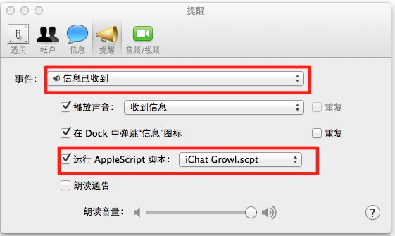

##脚本说明
本脚本为了解决Apple OS X自带的MessageApp无法启用Growl通知的问题
目前有两个脚本，有需要的可以都尝试一下  
目前都是基本可用的  
本人测试环境:  
Lion 10.7.3+Message Beta+Growl 1.3  

###使用方法
进入Message，打开**设置**,切换到**提醒**，然后在**事件**中选择“信息已收到”，在下面的**运行AppleScript脚本**中载入本脚本  

